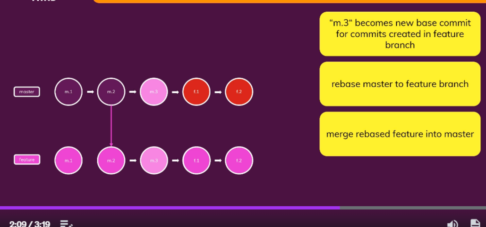

# Git & Github

Git is a <a href ="https://git-scm.com/">free and open source </a> distributed version control system designed to handle everything from small to very large projects with speed and efficiency.

Git is easy to learn and has a tiny footprint with lightning fast performance. It outclasses SCM tools like Subversion, CVS, Perforce, and ClearCase with features like cheap local branching, convenient staging areas, and multiple workflows.

<br/>

## Git + Github 


<br/>

## CMD


<br/>

# Windows Command prompt - Basic

## How to access a command prompt
There are two ways to open a command prompt in windows

__Method 1:__ Open windows by pressing windows key on the keyboard & search of CMD & press Enter

__Method 2:__ To open CMD press a short kept `Win + r`. Then the Run prompt opens in the open bar type __CMD__ & press enter.


By default the __CMD__ open at `user/user_name` module of computer

<br/>

**Basic Commands**

```
C:\Users\User_name> 
```
This the default view of the command prompt. We'll enter the required commands and execute throught **CLI**

#### __Dir__ stands for __Directory__ it'll display all the directories in the current directory


```
C:\Users\User_name> Dir
```


<br/>

## How to change to Root directory from the __absolute__ directory

### Absolute path always starts from the root Folder Where as relative path is the present file location.
```
C:\Users\User_name> cd /
C:\>
```
<br/>

## Change folders

The below command is use to change the directory. It'll take one directory backwards. Using this we can go a back a directory.
Here the __CD__ stands for **Change Directory**. In the same way as mentioned before, We can move forward by using **CD** command and mentioning the name of the folder we want to go to. We can also change the drives.

```
C:\Users\User_name> cd ..
C:\Users>
C:\Users> cd User_name
C:\Users\User_name>
C:\Users\User_name> D:
D:\>
```

## CRUD Files, Folders

```
C:\Users>mkdir Test
C:\Users>cd Test
C:\Users\Test> echo our first file> Test.txt
C:\Users\Test>type test.txt
    our first file
C:\Users\Test>mkdir other
C:\Users\Test>copy test.txt other
    1 file(s) copied.
C:\User\Test> move test.txt other
    1 file(s) move
C:\Users\Test>del test.txt
C:\Users\Test> cd ..
C:\Users>rmdir Test
```
<br/>

# Global Information Tracker - Git

Check the current version of git.
```
git --version
```

Always gives information about the working branch.
```
git status
```

Checking the log
```
git log
```

## Initializing

Initializing the repository using __git init__ Where it'll add a **.git** file,Which is hidden folder where all the details regarding the git are stored.
To initialize we use the following command.
```
git init
```
## Adding the files
After initializing the __git.__ We need to add the files & folder to the **staged** area. Here we can either mentioned the file name or can mention the dot(.) which will add all the files to the git.

```
git add .
```
<br/>

## Commit
After adding the files to git, We need to commit the files. Commits can be thought of as snapshots or milestones along the timeline of a Git project. Commits are created with the git commit command to capture the state of a project at that point in time.
```
git commit -m "First commit"
```

<br/>

## Branches
Git **Branches** are effectively a pointer to a snapshot of your changes. When you want to add a new feature or fix a bug—no matter how big or how small—you spawn a new branch to encapsulate your changes. 

```
git branch
git branch -b third-commit
git branch -m main
```

## Push
The git push command is used to upload local repository content to a remote repository. Pushing is how you transfer commits from your local repository to a remote repo. It's the counterpart to git fetch , but whereas fetching imports commits to local branches, pushing exports commits to remote branches. One of the famous app is **Github** by __Mirco-soft__.
```
git remote add origin https//github.com/user_name
git push -u origin main
```

## Checkout

The git checkout command lets you navigate between the branches created by git branch . Checking out a branch updates the files in the working directory to match the version stored in that branch, and it tells Git to record all new commits on that branch.

```
git checkout 
git branch second 
git checkout -b third branch
git checkout initial-commit.txt
git checkout . 
```

## Merging

Merging is Git's way of putting a forked history back together again. The git merge command lets you take the independent lines of development created by git branch and integrate them into a single branch. Note that all of the commands presented below merge into the current branch.

```
git merge third-branch
```

## Switch
The "switch" command allows you to switch your current HEAD branch. It's relatively new (added in Git v2. 23) and provides a simpler alternative to the classic "checkout" command. Before "switch" was available, changing branches had to be done with the "checkout" command.
```
git switch ( switch & create branches)
git switch -c fourth branch
```

## Head
In Git, HEAD refers to the currently checked-out branch's latest commit.

<br/>


x 

## Deleting

- Working directory Files
- Unstaged changes
- Staged changes
- Latest Commit(s)
- Branches

<br/>

## **NOTE** : 
If you delete a file in the working directory from the folder manually which is already committed. You can either restore or delete the file. The following commands are explore below.

<br/>

### List of files
Check the files in staging area
```
git ls-files
```
## Deleting **Working directory Files**
```
git rm file_name
```
## Undoing **unstaged** changes
The changes that are done to file which are not committed are known as unstages changes. We delete those changes by the following command. If there are multiple unstage changes we use **(checkout .)**.

```
git checkout file_name
git checkout .
```
Alternative way to do **Undo unstaged changes**

```
git restore initial-commit.txt
git restore .
```

## Deleting unstages files
To delete a file which is unstaged, We use **Clean** command **-d** delete **n** to list all the files.

From the below command we get a list of unstages file. You can cross check them before deleting.
```
git clean -dn
```
To delete the unstaged files.

```
 git clean -df
```

## Undoing **Staged** changes

Deleting staged changes from a commit

_Old way_
```
git reset file_name
git checkout file_name
```
_new way_

```
git restore --staged file_name
git checkout file_name
```

## Deleting the lastest commit

If we want to delete the latest commit.
We use `reset` command.
In the below code we can also mentioned multiple commits after **HEAD** to where we want to go. It can be 2,3 or more.
If we use soft command it'll delete the commit but the file will still exist in the staged area.
```
git reset --soft HEAD~1
```
The above command will delete the latest commit but the files is going to be in the stages area. To remove the file from staged area we use the following command.
If we just use **HEAD** the last commit will be deleted as well as the file from the staged area.

```
got reset HEAD~1
```
 
If you want to delete the commit from all the places, Should use the following command

```
git reset --hard HEAD~1
```

## Deleting branches
We can also delete the branches.
If you want to delete a branch which is already merged should use **-d**. If you want to delete the branch forcefully should use **-D**.

```
git branch -d file_name
git branch -D file_name file_name
```


## Detached HEAD

In Git, HEAD refers to the currently checked-out branch's latest commit. However, in a detached HEAD state, the HEAD does not point to any branch, but a specific commit or the remote repository.

For example if you have to do any changes to a previous commit. We can go the previos commit by using **checkout** command & with the **ID** of the commit. But, Now we're in the detached HEAD. As the HEAD is not pointing the lastest commit but a previous one. In this scenerio we can do changes to the commit & add the file to staged area & also commit the deatched HEAD. 

## How to add this changes to main branch?
In this scenerio we should create a branch for the deatched HEAD. Then merge that code with the main branch

```
git branch <branch_name>  
```
Then add and commit the changes. Then switch to main branch and merger the code with the main branch.

## **.gitignore**


We should manually create [gitignore](https://git-scm.com/docsgitignore#:~:text=A%20gitignore%20file%20specifies%20intentionally,gitignore%20file%20specifies%20a%20pattern.) file. Then add the specfic folder to it.


## Stash

Git stash temporarily shelves (or stashes) changes you've Gade to your working copy so you can work on something else, and then come back and re-apply them later on.

```
git stash
```
Then we can work on that previous commit & the file to staged area & even commit them.
To get back we use
```
git stash apply
git stash push -m "this is a message"
git stash drop 0
git stash clear
```

To add the stash to rh project

```
git stash pop 0
```

## Reflog

 Git uses the git reflog tool to keep track of changes made to branch tips. It lets you go back to any commit, even if it isn’t referenced by any branch or tag. Following the rewriting of history, the reflog contains information about the former state of branches and allows for reverting to that state if necessary. It's only stored last 30 days of data.

 ```
 git reflog
 ```


We need select the has in front of the commit we want to go and should enter the following command

```
git reset --hard Hash_number
```

We can also restore deleted branches.
First we need to checkout the commit by using the following command.

```
git checkout Hash_number
```

Then we need create the new branch and so that this detached head data can be saved in the new branch. Then mrege it with the **main** branch.


## Understanding the **merge** command

<br/>


<br/>

## Fast Forwarding

Fast forward merge can be performed when there is a direct linear path from the source branch to the target branch. In fast-forward merge, git simply moves the source branch pointer to the target branch pointer without creating an extra merge commit.


Rather than adding all the commit to main branch. We can just use **--squash** as the name mentioned. It'll squash all the commits into one & add those files to staged area in the main branch. Then we need to commit that changes.
 
 Instead of having

 **Master m1 -> m2 -> f1 -> f2(HEAD)**

 We'll be having

 **Master m1 -> m2 -> m3(HEAD)**

 ```
 git merge --squash branc_name
 git commit -m "merge"
 ```

## Recursive merge (Non-Fast-Forward)

```
git merge --no--ff branch_name
```
In recursive merge we can also merge branches when there is another commit after creating the a branch. In this case the recursive merge will create a new commit and add those branch to the new commit and makes the new commit as its head. Rather then refering the last commit as the HEAD.


## Rebase

Rebase adds the commit to the feature branch which are committed after create a new branch. 




If we use rebase from the feature branch to merge to the main branch. There raises a problem.

main m1 -> m2 -> m3
feature m1 -> m2 -> f1 -> f2

Here we are trying to merge the code with the main branch. So, we use **Rebase**.

```
git rebase main
```

Here when merging it'll create a new commit in **main** branch. So, It changes the history. which is not good when your working in a sharing project. This rebase can only be used if you work on local projects.


## abort a merge

```
git merge --abort
``` 

## check difference
```
git diff
```

## Conflits

If multiple people worked on a same file. There may rise a conflit when they merge it. As, both have done changes to the same file. To over come there are two methods.

**Method 1** : When using **VScode** a merge is performed on this kind of files. It'll automatically detect the changes and gives us a screen where we can compare, accept first change or second change, Accept both the changes etc. Then commit the file


## Cherry picking git

Git cherry-pick is a powerful command that enables arbitrary Git commits to be picked by reference and appended to the current working HEAD. Cherry picking is the act of picking a commit from a branch and applying it to another. git cherry-pick can be useful for undoing changes.


```
git cherry-pick commit_id
```

## Tag

Tags are ref's that point to specific points in Git history. Tagging is generally used to capture a point in history that is used for a marked version release (i.e. v1. 0.1). A tag is like a branch that doesn't change. Unlike branches, tags, after being created, have no further history of commits.

```
git tag
git tag 1.0 commit_id
git show 1.0
git tag -d 1.0
```


<br/>

# GitHub

[GitHub](https://github.com/), Inc. is an Internet hosting service for software development and version control using Git. It provides the distributed version control of Git plus access control, bug tracking, software feature requests, task management, continuous integration, and wikis for every project.


It'll show all the local branches available.
```
git branch -a
```

To only view remote branches
```
git branch -r   
```

To view all the branches from remote also. We add.
```
git ls-remote
```


## From local to remote

How does github works from local to remote


Before adding the changes to remote branch first the changes are added to a **Remote tracking branch** in which after we push the code to remote repo by
`git push origin master`. Then changes are first updated to __Remote tracking branch__ then it'll push to **Remote branch** vise versa when we pull from the remote repo. 


<br/>

## Remote tracking branch

[Remote-tracking](https://git-scm.com/book/en/v2/Git-Branching-Remote-Branches#:~:text=Remote%2Dtracking%20branches%20are%20references,state%20of%20the%20remote%20repository.) branches are references to the state of remote branches. They're local references that you can't move; Git moves them for you whenever you do any network communication, to make sure they accurately represent the state of the remote repository.

Remote tracking branches are the local copy of the remote branch. This are created when we first started to push to remote repo.


## Connecting to remote Repo

```
git init
git add .
git commit -m "Commit-message"
git branch -M main (We are changing the master branch to main for naming convension)
git remote add origin <Remote_URL>
git push -u origin main
```

## Git Pull

We use git pull command to pull the data from the remote repo into our local branch.

```
git pull origin main
```
In git pull is only possible when we have a local copy of the remote branch. 0ther wise git won't understand where to merge the branch which is pulled. 

For instance: If we created another branch in remot repo. When we try to pull that repo, Git will display error as the branch we are fetching have no data in the local. In that scenario. We use git `fetch`.

## Fetch

Git fetch is used to fetch the latest state from the remote repo. It won't update the data it'll just fetch the data and create a local copy of the data ( If we previously don't have the data). 

```
git fetch origin
```

After fetching data we can pull the data.
When we use fetch git creates a local copy of the remote branch ( If any exists ). Then the local copy of the remote branch is created. But it won't update the local branch. In this scenerio, We go to the local copy of the remote tracking branch and checkout the branch, then the branch will turn into a detached head state as it not pointing to any branch. We need to merge the code with the required branch. 
We can use an alternate method `Local tracking branch`.


## Local tracking branch


<br/>

As mentioned before we have remote tracking branch it's a local copy of the remote branch. We create a `local tracking branch` which is reference to remote tracking branch & we can edit it.
When ever we push our data to remote repo. We'll edit the local tracking branch which will send that remote tracking branch which will send it to remote branch.


Creating a local-tracking-branch

```
git branch --track branch_name origin/branch_name
```
When naming the local-remote-branch. We need to name it same as the remote tracking branch. So, that we can directly push.

We create a branch local-tracking-branch with the same name as remote-tracking-branch. Then we do changes to the LTB(local-tracking-branch). Then just we use `git push/pull` directly with out mentioned origin. As, we are directly connected to the remote-tracking-branch.

To know more about the branches
```
git branch -vv
```

Will show remote, we get information about the remote branches, how we configure git pull & current environment.

```
git remote
git remote show origin
```


## Git clone

It'll clone git repo into local repo.

```
git clone URL .
```

## Upstream

Like the literal meaning, upstream refers to something which points to where it originated from. In the git world, upstream refers to the original repo or a branch. For example, when you clone from Github, the remote Github repo is upstream for the cloned local copy.

We need not to create local tracking branch if used this command it'll automatically create a the local-tracking-branch.

```
git push -u origin main
```
## Delete

Deleting remote tracking branch. We can also delete remote tracking branches, Like branches remote tracking branches needs a new command for deleting them.

```
git branch --delete --remote <Name_of_the_Branch>
```

In this scenerio we only delete remote-tracking-branches which are local. To delete branches even in github we need to either push or pull. So, we use.

```
git push origin --delete Name_branch
```

Force pushing
```
git push --force origin main
```


<br/>

# Github - DeepDive
## Collaboration & Contribution


